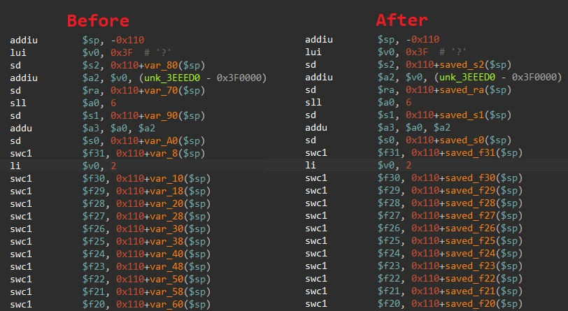
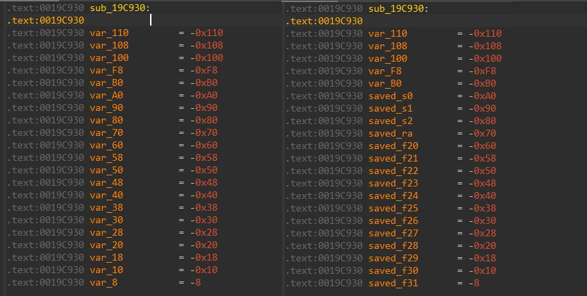

# Mips saved registers renamer
 Renames stack variables used to save MIPS registers. Plugin is modified version of mipslocalvars: https://github.com/tacnetsol/ida/tree/master/plugins/mipslocalvars

## Changes
* Removed plugin entry from "Options".
* Added shortcut to run plugin "Alt + Shift + 2".
* Extended search depth to 35 (original 25 was too low with new features).
* Added floating point saved registers, assuming that COP1 is used as FPU.
* Added quadroword save to suspected opcodes, now support sw, sd, sq.
* Support both single, and double floats save opcodes (swc1, sdc1).
* Above changes improve compatibility with PS2/N64/PSP assembly. 
* Simplified plugin entrypoint.
* Add check to make sure that autoanalyze already finished. Plugin need resolved stack to work correctly.
* Unload plugin if selected architecture is not MIPS.

## Usage
 Just copy mips_stack.py into your IDA *plugins* directory.
 Run by keyboard shortcut "Alt + Shift + 2", 
 or go to Edit --> Plugins --> Mips saved registers renamer.
 

